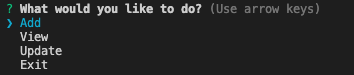
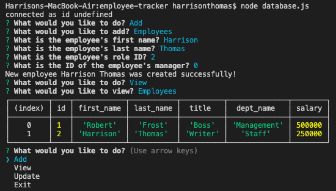

# Employee Tracker
## Your convenient database for employee, job, and departments management.

## Purpose
This command line interface allows the user to update and add to a database of employees, jobs, and departments.

## User Story
**AS A** business owner
**I WANT TO** be able to view and manage the departments, roles, and employees in my company
**SO THAT I** can organize and plan my business

## How it works
First, after cloning the repo, make sure to npm install **dotenv**, **inquirer**, and **mysql**. Then, run the server app from the command line.

Then, you can use your arrow keys to navigate the menu. You can add, view, or update employees, departments, and roles.

### Very Important!
You must create the roles and departments before creating employees. Otherwise, the employees will not be added to the database.

